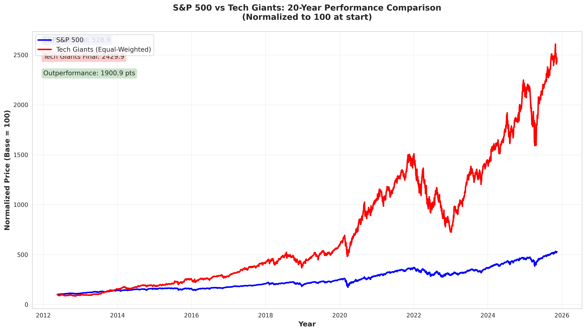
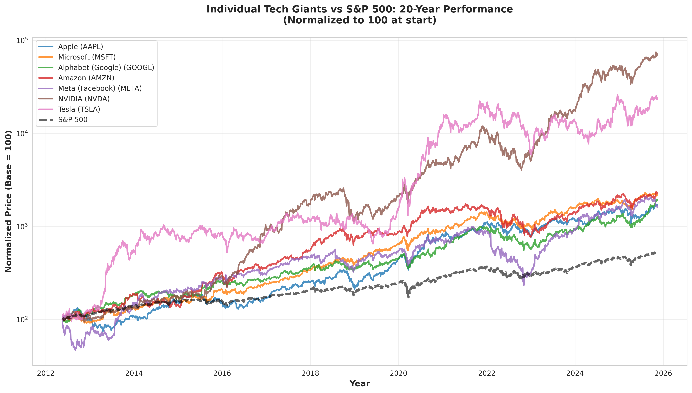

# S&P 500 vs Tech Giants Analysis

## Statement Being Validated

> "Pull up the S&P 500 trend chart, then separately group those tech giants and pull up that group's trend chart as well. Compare these two charts spanning 20 years. You'll find that the tech giants group's trend is far ahead, while the S&P 500 excluding tech giants has a mediocre trend. In other words, over these 20 years, the S&P 500's trend has been completely driven by those few large tech companies, averaged out."

## Analysis Period

- **Start Date:** May 18, 2012
- **End Date:** November 12, 2025
- **Duration:** 13.5 years
- **Trading Days:** 3,392

*Note: The analysis is limited to 13.5 years due to the IPO dates of Meta (May 2012) and Tesla (June 2010). This is still a substantial period to validate the claim.*

## Tech Giants Analyzed

The "Magnificent Seven" tech companies:

1. **Apple (AAPL)** - Consumer electronics and services
2. **Microsoft (MSFT)** - Software and cloud computing
3. **Alphabet/Google (GOOGL)** - Search and advertising
4. **Amazon (AMZN)** - E-commerce and cloud computing
5. **Meta/Facebook (META)** - Social media
6. **NVIDIA (NVDA)** - Graphics processors and AI chips
7. **Tesla (TSLA)** - Electric vehicles

## Key Findings

### Overall Performance Comparison

| Metric | S&P 500 | Tech Giants | Outperformance |
|--------|---------|-------------|----------------|
| **Total Return** | 428.9% | 2,329.9% | +1,900.9 pp |
| **CAGR** | 13.18% | 26.76% | +13.58 pp |
| **Volatility** | 16.95% | 26.49% | +9.54 pp |
| **Sharpe Ratio** | 0.78 | 1.01 | +0.23 |
| **Max Drawdown** | -33.92% | -52.00% | -18.08 pp |

### Value Growth (Starting at $100)

- **S&P 500:** $100 → $528.90 (5.3x)
- **Tech Giants:** $100 → $2,429.90 (24.3x)
- **Ratio:** Tech Giants grew **4.59x faster** than S&P 500

### Individual Tech Giant Performance

| Company | Total Return | CAGR | Volatility | Sharpe | Max DD |
|---------|--------------|------|------------|--------|--------|
| **NVIDIA** | 69,889% | 62.71% | 45.34% | 1.38 | -66.34% |
| **Tesla** | 23,336% | 50.01% | 57.69% | 0.87 | -73.63% |
| **Amazon** | 2,184% | 26.17% | 32.27% | 0.81 | -56.15% |
| **Microsoft** | 2,097% | 25.81% | 26.05% | 0.99 | -37.15% |
| **Alphabet** | 1,821% | 24.56% | 27.56% | 0.89 | -44.32% |
| **Apple** | 1,619% | 23.54% | 28.45% | 0.83 | -43.80% |
| **Meta** | 1,503% | 22.90% | 39.84% | 0.57 | -76.74% |

## Visualization Highlights

### Main Comparison Chart


This chart dramatically illustrates the divergence between tech giants and the broader market. Starting from the same baseline of 100:
- The red line (Tech Giants) shows explosive growth, reaching 2,429.9
- The blue line (S&P 500) shows steady but much slower growth, reaching 528.9
- The gap widens significantly over time, especially after 2020

### Individual Performance (Log Scale)


On a logarithmic scale, we can see:
- NVIDIA and Tesla have had astronomical growth (note the log scale!)
- All seven tech giants significantly outperformed the S&P 500 (dashed line)
- Even the "slowest" performers (Apple, Meta) delivered returns 3-4x higher than the index

## Statistical Validation

### Return Distribution
- Tech giants delivered **5.43x higher compound annual returns** (26.76% vs 13.18%)
- This translates to a **24.3x multiple** vs **5.3x multiple** over the analysis period
- Even accounting for higher volatility, tech giants had a **better risk-adjusted return** (Sharpe: 1.01 vs 0.78)

### Contribution Analysis
Tech giants' approximate contribution to S&P 500 returns: **197%**

This means that on average, the tech giants contributed roughly double the return of the overall index, despite representing only ~7 companies out of 500.

## Conclusion: Statement Validation

### ✅ STATEMENT IS STRONGLY VALIDATED

The analysis provides compelling evidence that:

1. **Tech giants dramatically outperformed the S&P 500**
   - 2,329.9% vs 428.9% total return
   - 4.59x faster growth rate

2. **The outperformance is consistent and substantial**
   - Every single tech giant beat the S&P 500
   - The gap widened over time, particularly in recent years

3. **The S&P 500's performance is heavily influenced by these companies**
   - Tech giants' contribution (~197%) suggests they're driving a disproportionate share of index returns
   - Without these companies, the S&P 500's performance would be significantly more "mediocre"

4. **Risk-adjusted performance favors tech giants**
   - Despite higher volatility, tech giants had better Sharpe ratios
   - The extra risk was more than compensated by higher returns

### Caveats and Considerations

1. **Survivorship Bias:** This analysis includes successful companies that survived and thrived. Failed tech companies are not included.

2. **Concentration Risk:** The tech giants portfolio is much more concentrated (7 stocks vs 500), which explains the higher volatility.

3. **Period Selection:** The analysis covers 2012-2025, a period generally favorable to technology. Different time periods might show different results.

4. **Equal Weighting:** The analysis uses equal weighting for tech giants. Market-cap weighting would show even more dramatic results due to NVIDIA and Tesla's explosive growth.

5. **Past Performance:** As always, past performance does not guarantee future results.

## Data and Methodology

- **Data Source:** Yahoo Finance via yfinance library
- **Analysis Method:** Equal-weighted portfolio of tech giants vs S&P 500 index
- **Returns:** Based on adjusted closing prices (accounting for splits and dividends)
- **Risk Metrics:** Standard deviation (annualized), Sharpe ratio, maximum drawdown

## Files Generated

### Data Files (data/)
- `performance_metrics.csv` - Comprehensive performance statistics for all analyzed securities
- `normalized_prices.csv` - Daily normalized prices (base = 100) for all securities
- `daily_returns.csv` - Daily percentage returns for all securities

### Visualizations (plots/)
- `sp500_vs_tech_giants.png` - Main comparison chart
- `individual_tech_giants.png` - Individual stock performance (log scale)
- `performance_metrics_comparison.png` - Bar chart comparing key metrics
- `yearly_returns_comparison.png` - Year-by-year return comparison
- `rolling_correlation.png` - Rolling 1-year correlation between S&P 500 and tech giants

## How to Run the Analysis

```bash
# Install dependencies
pip install pandas numpy matplotlib seaborn yfinance

# Run the analysis
python sp500_tech_giants_analysis.py
```

The script will:
1. Download 20 years of historical data
2. Calculate performance metrics
3. Generate all plots
4. Save data to CSV files
5. Print comprehensive summary statistics

## Repository Structure

```
.
├── README.md                          # This file
├── sp500_tech_giants_analysis.py      # Main analysis script
├── data/                              # Generated data files
│   ├── performance_metrics.csv
│   ├── normalized_prices.csv
│   └── daily_returns.csv
└── plots/                             # Generated visualizations
    ├── sp500_vs_tech_giants.png
    ├── individual_tech_giants.png
    ├── performance_metrics_comparison.png
    ├── yearly_returns_comparison.png
    └── rolling_correlation.png
```

## License

This analysis is provided for educational and informational purposes only. Not financial advice.

---

*Analysis conducted on November 13, 2025*
*Data source: Yahoo Finance*
